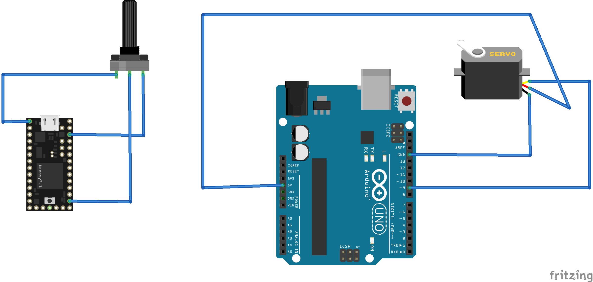

# Potentiometer Control Of Servo Via ROS

This tutorial walks readers through the setup of hardware and software necessary for implementing control of a hobby servo with a potentiometer via ROS topics.

# Hardware Setup


This demo will make use of a Teensy3.2 and a Arduino UNO as the main micro-controllers. These two micro-controllers connect to a ROS capable laptop computer via a USB connection. One micro-controller reads in a value from a potentiometer, while the other drives a servo using PWM control. See the figure below for a schematic view of this setup.



Please note that the above schematic does not depict the connection of the micro-controllers to the ROS enabled laptop.


# Software Setup

This tutorial assumes the user has installed the rosserial meta-package as well as the ROS arduino libraries. See this [page](http://wiki.ros.org/rosserial_arduino/Tutorials/Arduino%20IDE%20Setup) for tutorials on getting these installed if you have not already.

In this example, a ROS node running on the Teensy publishes data read from the potentiometer over the Int32 topic. A ROS node running on the Arduino UNO subscribes to this data and moves the servo accordingly. On the laptop, two instances of the rosserial bridge instance run to control serial communication with each device. These nodes functionally act as a software bridge between the ROS nodes on the micro-controllers and the rest of the system.

## Potentiometer Publisher

Let's walk through some of the code of the potentiometer publisher node.

```cpp
/***********************************************
 * Defines
 ***********************************************
 */
#define POT_PIN   A0
#define MAX_IN    1023
#define MAX_OUT   180
#define MIN_IN    0
#define MIN_OUT   0

/***********************************************
 * Variables 
 ***********************************************
 */
long potentiometer_val = 0;
long mapped_val = 0;

ros::NodeHandle  nh;
std_msgs::Int32 pot_val_mapped_msg;
ros::Publisher ServoController("ServoController", &pot_val_mapped_msg);
```

Here we can see define constants and variables for potentiometer values. Notice the explicit delcaration of an Int32 message instance. In the last line, we instantiate the ros publisher object.

```cpp
void setup() {
  pinMode(POT_PIN, INPUT);
  
  nh.initNode();
  nh.advertise(ServoController);  
}
```

In the setup function, the potentiometer pin is set to an input and the nodehandle object is initialized. The nodehandler starts advertising the publishing of the Int32 message containing our potentiometer data. This allows other nodes and ROS utilities to know that this node is publishing Int32 data.

```cpp
void loop() {
  potentiometer_val = analogRead(POT_PIN);
  mapped_val = map(potentiometer_val, MIN_IN, MAX_IN, MIN_OUT, MAX_OUT);
  mapped_val = constrain(mapped_val, MIN_OUT, MAX_OUT);

  pot_val_mapped_msg.data = mapped_val;
  ServoController.publish(&pot_val_mapped_msg);
  
  nh.spinOnce();
  delay(50);
}
```

Here in the loop function, the potentiometer is read and mapped to a value between 0 and 180. This value is then set to the data payload of the Int32 message. This message is then published to the rest of the system via rosserial. The last two lines allow for the message to be succesfully published before repeating the loop.

## Servo Subscriber

The servo subscriber node runs on the arduino UNO and writes the value obtained over ROS serial to the attached servo. Due to a lot of the potentiometer value post-processing done in the publisher node, this program is much less complex.

```cpp
/***********************************************
 * Defines
 ***********************************************
 */
 #define SERVO_PIN 9

/***********************************************
 * Function Prototypes 
 ***********************************************
 */
void ServoUpdateCallback(const std_msgs::Int32& mapped_val);

/***********************************************
 * Variables 
 ***********************************************
 */
long servo_val = 0;

ros::NodeHandle nh;
ros::Subscriber<std_msgs::Int32> subscriber("ServoController", &ServoUpdateCallback);

Servo Servo_1;
```

Here, as in the publisher node, a NodeHandle object is instantiated. A ROS subscriber object is also instantiated and the reference to a callback function is passed to it's constructor. This callback will run whenever a new message is recieved. 

```cpp
void setup() {
  Servo_1.attach(SERVO_PIN);
  nh.initNode();
  nh.subscribe(subscriber);
}
```

Here in the setup function, the servo is attached to pin 9. As in the publisher node, the NodeHandler object is setup and subscription to the topic defined in the subsciber object from the above code snippet begins.

```cpp
void loop() {
  nh.spinOnce();
  delay(50);  
}

void ServoUpdateCallback(const std_msgs::Int32& mapped_val)
{
  Servo_1.write(mapped_val.data);
}
```

Here in the loop function, we can see the loop runs waiting for a message to be recieved. As soon as a message is recieve the callback function ServoUpdateCallback is run. Upon inspection of this function, it can be seen the value data payload from the message recieved is written to the servo via PWM.

## Laptop setup

Once both micro-controllers have the provided code flashed onto them, communication can begin. To setup the two rosserial software bridge nodes, run the rosserial_servo-pot_example.launch found in the scripts directory. This file is a roslaunch file, which are commonly used to launch various ROS nodes. Let's step through the launch file to understand how it works.

```xml
<launch>
    <node name="serial_node1" pkg="rosserial_python" type="serial_node.py" output="screen">
        <param name="port" value="/dev/ttyACM0" />
        <param name="baud" value="57600" />
    </node>

    <node name="serial_node2" pkg="rosserial_python" type="serial_node.py" output="screen">
        <param name="port" value="/dev/ttyUSB0" />
        <param name="baud" value="57600" />
    </node>
</launch>
```

roslaunch files are just xml files with special tags. This file launches two rosserial\_python nodes with the handles serial\_node1 and serial\_node2. Each of these nodes are given parameters of baudrate and serial port. 

To run this roslaunch file type the following command in a terminal

```console
user@user:~$ roslaunch rosserial_servo-pot_example.launch
```

If an instance of rosmaster is not yet running, executing this roslaunch file will make an instance of rosmaster.

# Demo Video Link

See this youtube [video](https://youtu.be/ZQzFy3OdAiA) for a demo of the tutorial result.
